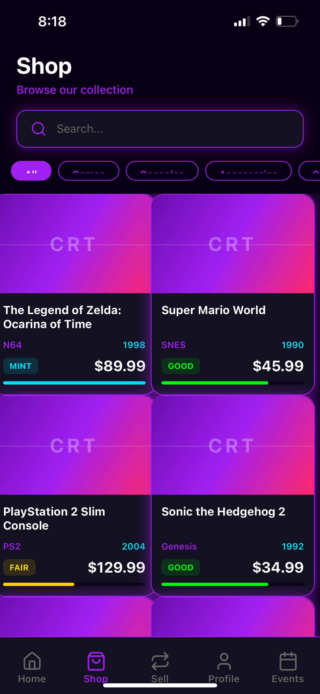
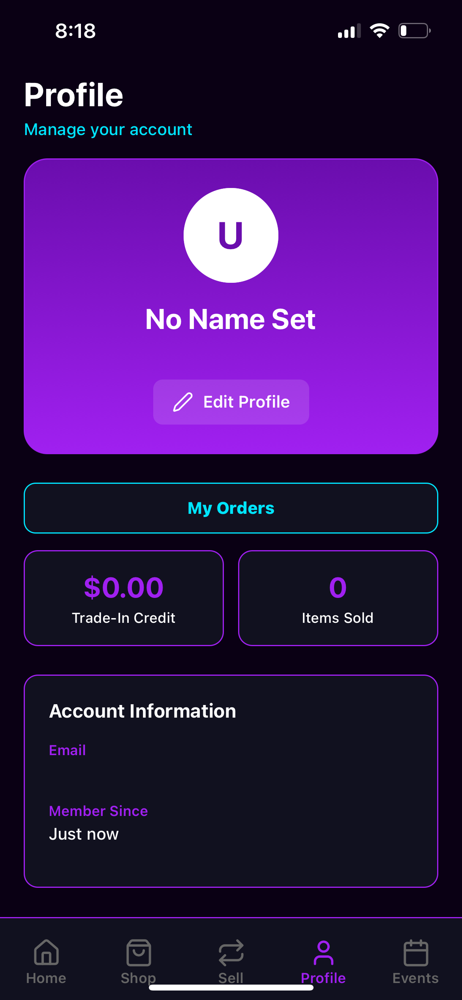

# Retro Hall — Mobile App (Expo + Supabase + Stripe)

Retro Hall is a production-minded mobile app for a retro game / TCG shop. It includes:
- **Shop + Inventory** (stock, featured items, low-stock thresholds)
- **Events** (create/manage events, join/leave, attendance tracking)
- **Table Reservations** (user booking + admin management, with table-number conflict prevention)
- **Orders / Preorders** (atomic stock reservation via Postgres RPC)
- **Broadcast Announcements** (in-app notifications + push notifications)
- **Admin Dashboard + Analytics** (reservation usage + attendance trends)
- **Stripe Checkout** (Supabase Edge Functions + webhooks)

> This repo is designed to be a **deployable portfolio project** and a **real business control center**.

---

## Tech Stack

- **Expo / React Native** + TypeScript
- **expo-router** navigation
- **Supabase** (Auth, Postgres, RLS, Realtime)
- **Supabase Edge Functions** (Stripe Checkout + webhook)
- **Stripe Checkout** (payment collection + webhook-driven order updates)
- **Expo Notifications** (push tokens, broadcast push)

---
# Screenshots






## Project Structure

```
app/                    # Screens (expo-router)
  (tabs)/               # Main tab navigation
  admin/                # Admin panel (dashboard, events, orders, inventory, reservations, analytics, broadcasts)
  auth/                 # Sign in / sign up
components/             # UI components
contexts/               # Auth / app contexts
hooks/                  # Custom hooks (push notifications, etc.)
lib/                    # Supabase client + shared utilities
supabase/
  schema.sql            # DB schema, RLS policies, indexes, RPCs
  functions/            # Edge Functions (Stripe)
STRIPE_SETUP.md         # Stripe deployment + webhook setup
```

---

## Quick Start (Local Dev)

### 1) Install dependencies
```bash
npm install
```

### 2) Set environment variables
Create / update `.env` at the project root:

```bash
EXPO_PUBLIC_SUPABASE_URL=YOUR_SUPABASE_URL
EXPO_PUBLIC_SUPABASE_ANON_KEY=YOUR_SUPABASE_ANON_KEY
```

> **Tip:** Keep `.env` out of version control (it already should be in `.gitignore`).

### 3) Start the app
```bash
npx expo start
```

- For push notifications: use a **real device** (Expo Go + QR code).

---

## Supabase Setup (Database + Security)

### 1) Create a Supabase project
In the Supabase dashboard:
- Create a new project
- Copy the **Project URL** and **Anon key** into `.env`

### 2) Apply schema + policies
Supabase → **SQL Editor** → run:

- `supabase/schema.sql`

This creates (and/or upgrades) tables, indexes, RLS policies, and the RPC used for atomic ordering.

### 3) Make yourself an admin
After you sign up in the app, add your user id to `admin_users`:

Supabase → Table Editor → `admin_users` → Insert Row:
- `id = <your auth.user id>`

Once added, the app will show **Profile → Admin Panel**.

---

## Stripe Setup (Payments)

Stripe integration is implemented with **Supabase Edge Functions** and webhooks.

✅ Follow the full, step-by-step guide here:
- `STRIPE_SETUP.md`

High-level checklist:
1. Create Stripe API keys + webhook signing secret
2. Deploy Edge Functions:
   - `create-checkout-session`
   - `stripe-webhook`
   - `stripe-redirect` (for https success/cancel redirects)
3. Configure Stripe webhook events:
   - `checkout.session.completed` (required)

> Webhooks are required because users may close Checkout or not return to the app.

---

## Push Notifications Setup

Push notifications are enabled via **Expo Notifications**.

### How it works
- On a real device, after login the app requests notification permissions and saves the Expo push token to:
  - `user_profiles.expo_push_token`

- Admin broadcasts send:
  1) In-app notifications (stored in `notifications`)
  2) Push notifications (best-effort to all saved tokens)

### Notes
- Push tokens do **not** work reliably on simulators.
- For production builds, prefer **EAS Build** (recommended).

---

## How to Use the App (User)

### Create an account
- Open the app → Sign Up
- Confirm email if your Supabase Auth settings require it

### Shop
- Browse products
- Tap a product → Request Purchase / Request Preorder
- View orders in **Profile → My Orders**
- Pay for pending orders with **Stripe Checkout**

### Events
- Browse events
- Open event details → Join/Leave
- Optionally book a table for an event

### Reservations
- Book a table via the reservation screens
- View/cancel your reservations

---

## How to Use the Admin Panel

Go to **Profile → Admin Panel**

### Admin Dashboard
- Quick counts and navigation

### Inventory
- Adjust stock (+/- or exact)
- Set low-stock thresholds
- Toggle featured items
- Filter/search inventory

### Products
- Create / edit / delete products
- Set condition, stock, etc.

### Events
- Create / edit / delete events
- View event details and attendance

### Reservations
- View all reservations
- Filter by date / status
- Assign table numbers
- Mark as done / cancel / no-show
- **Table-number conflicts are prevented** (app-level check + DB unique index)

### Orders
- View orders and statuses
- Update status (pending → paid → fulfilled, etc.)
- Cancel/refund behaviors are supported (stock restoration is handled where applicable)

### Analytics
- Reservation usage trends (last 30 days)
- Attendance trends (last 90 days)

### Broadcasts
- Send announcements to all users (in-app + push)
- View broadcast history

---

## How Orders Work (Atomic + Safe)

A common production pitfall is overselling inventory when multiple people buy at the same time.

This app avoids that by creating orders through a **single Postgres RPC** that runs in one transaction:

**RPC:** `public.create_order_request(p_product_id uuid, p_quantity int)`

What it does:
1. Locks the product row (`FOR UPDATE`)
2. If `stock_qty >= quantity`:
   - Decrements stock
   - Creates an order + order item
   - Returns `is_preorder = false`
3. If out of stock:
   - Creates a preorder without changing stock
   - Returns `is_preorder = true`

This guarantees consistent inventory and order state.

---

## Testing Checklist (Recommended)

### Core flows
- [ ] Sign up / sign in
- [ ] Admin panel visible only to admins
- [ ] Create product with stock
- [ ] User requests purchase → stock decrements → order created
- [ ] User requests purchase when stock is 0 → preorder created (no stock change)
- [ ] Stripe pay → webhook marks order paid
- [ ] Admin fulfills order

### Reservations
- [ ] User books reservation
- [ ] Admin assigns table number
- [ ] Attempt to assign same table/date/slot to another active reservation → should fail

### Broadcasts + Push
- [ ] Send broadcast → shows in Notifications screen
- [ ] On real device, receive push notification

---

## Debugging Guide

### 1) Expo + Metro
- Clear cache:
  ```bash
  npx expo start -c
  ```

### 2) Environment variables not loading
- Confirm `.env` exists at project root
- Restart Metro after changes

### 3) Supabase errors / permission denied
- Check RLS policies in `schema.sql`
- Confirm your user is in `admin_users` for admin actions

### 4) Stripe issues
- Confirm Edge Functions are deployed
- Confirm webhook signing secret is set in Supabase function env vars
- Check Stripe webhook logs in Stripe Dashboard
- Use `STRIPE_SETUP.md` to verify URLs and events

### 5) Push notifications not arriving
- Must test on a **real device**
- Confirm `expo_push_token` is stored for the user in `user_profiles`
- Confirm notification permission granted on the phone

---

## Deployment Notes

### Recommended path
- Use **EAS Build** for iOS/Android binaries
- Ensure:
  - App scheme is configured (`app.json`)
  - Supabase and Stripe env vars are set correctly
  - Edge Functions are deployed
  - Webhooks configured in Stripe

---

## License
Private / internal use unless you choose to open-source it.

---

## Support
If something breaks, the fastest way to debug is:
1) Copy the error message
2) Tell me which screen you were on and what button you pressed
3) Include the relevant Supabase logs (Auth logs / Edge Function logs if Stripe)

## Documentation
Additional professional documentation lives in `/docs`:
- Architecture overview
- Database ERD
- Security notes
- Release checklist
- Hiring manager summary


### Inventory Ops (SKU/Barcode + CSV)
Admins can export inventory to CSV and bulk import updates from CSV in **Admin → Inventory**. SKU and barcode are optional but recommended for stable identifiers.


### Admin Roles (Owner vs Staff)
`admin_users.role` supports `owner` and `staff`. Owners can manage admin users in **Admin → Admin Users**.
