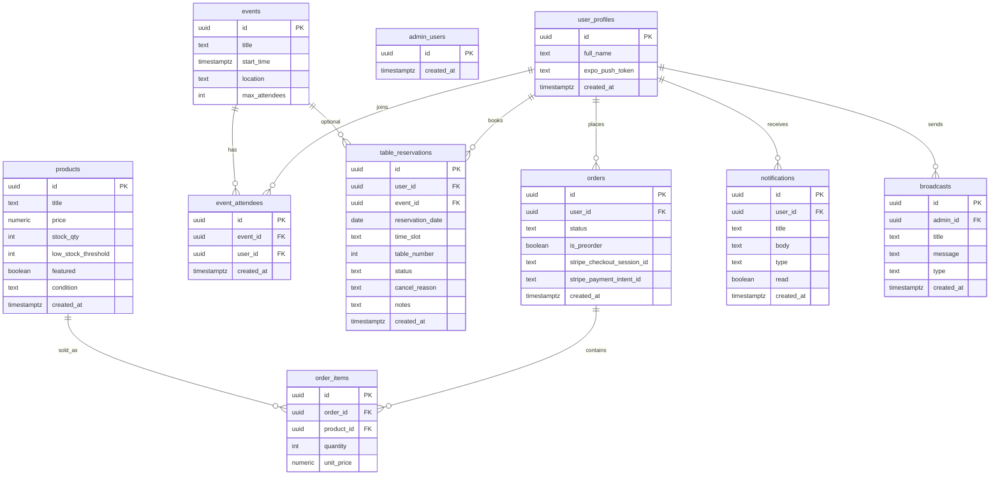

# Retro Hall — Database & ERD

This project uses Supabase Postgres with Row Level Security (RLS) enabled.

## Core Tables
- `user_profiles` — user metadata + expo push token
- `admin_users` — whitelist for admin access
- `products` — inventory
- `events` — events
- `event_attendees` — many-to-many join between users and events
- `table_reservations` — table bookings
- `orders` — purchase/preorder records
- `order_items` — items per order
- `notifications` — per-user in-app notifications
- `broadcasts` — admin broadcast history

## Suggested ERD (Mermaid)

## Atomic Order Creation (RPC)
The function `create_order_request(product_id, quantity)` performs a single DB transaction to:
- lock the product row
- decrement stock (if available)
- create `orders` + `order_items`
- return the order id

This prevents overselling under concurrent requests.

## Indexing Recommendations
- `table_reservations (reservation_date, time_slot)` for admin filtering
- `event_attendees (event_id)` for attendance counts
- `orders (user_id, created_at)` for order history

### Admin Roles
`admin_users` includes:
- `id` (auth uid)
- `role` (`owner` | `staff`)
Owners can manage the admin roster; staff cannot.
